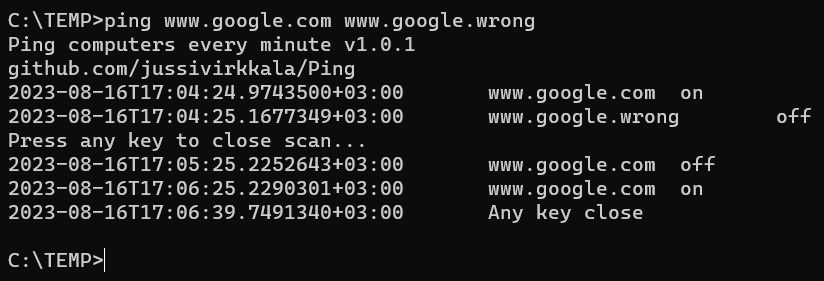

# Ping
Ping computers every minute. THE SOFTWARE IS PROVIDED "AS IS", WITHOUT WARRANTY OF ANY KIND...


Build .NET7 SDK (www.dot.net) into single win-x64 exe with following command.
```
dotnet publish -r win-x64 -c Release --self-contained true -p:PublishSingleFile=true -p:IncludeAllContentForSelfExtract=true
``` 
You can also download x64 Windows binary [Ping.exe](Ping.exe)
 with SHA256: 


