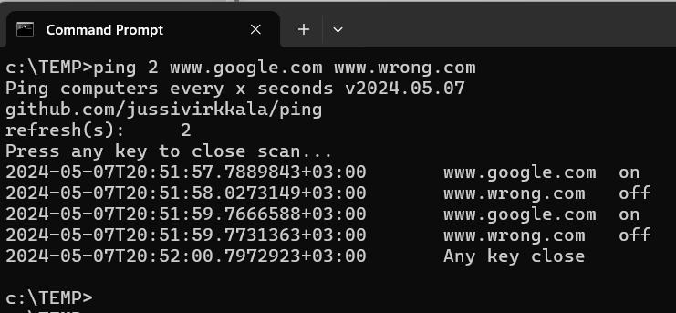

# Ping
Ping computers with defined interval. THE SOFTWARE IS PROVIDED "AS IS", WITHOUT WARRANTY OF ANY KIND...


Build .NET8.0.4 SDK (www.dot.net) into single win-x64 exe with following command.
```
dotnet publish  -p:IncludeAllContentForSelfExtract=true
``` 

Project file has 
``` 
<PublishTrimmed>true</PublishTrimmed>
<PublishSingleFile>true</PublishSingleFile>
<SelfContained>true</SelfContained>
<RuntimeIdentifier>win-x64</RuntimeIdentifier>		
``` 
You can also download x64 Windows binary [Ping.exe](Ping.exe)
 with SHA256: 


